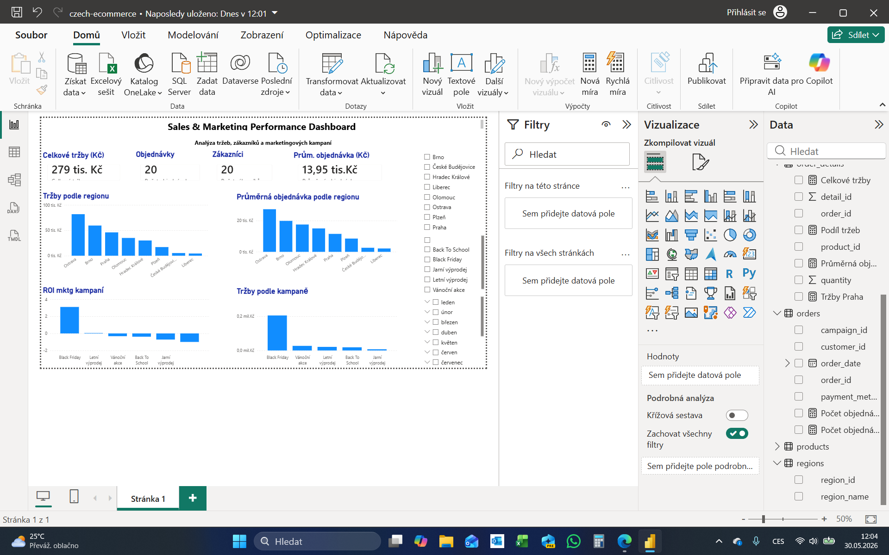
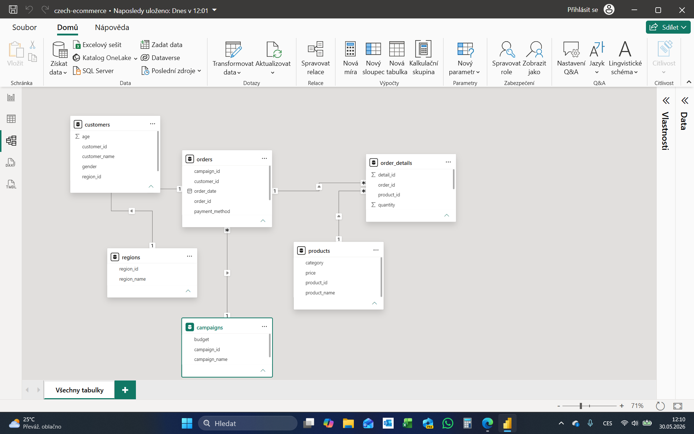

# Sales & Marketing Performance Dashboard

## Náhled dashboardu



Power BI case study zaměřená na analýzu prodejů, zákazníků a výkonnosti marketingových kampaní v prostředí e-commerce.

## Cíl projektu

Cílem projektu bylo vytvořit kompletní Business Intelligence řešení od přípravy dat až po interaktivní dashboard.

Projekt zahrnuje:

- čištění dat v Power Query
- návrh datového modelu
- tvorbu DAX metrik
- tvorbu interaktivního dashboardu
- analýzu regionů, zákazníků a marketingových kampaní

---

## Použité technologie

- Power BI Desktop
- Power Query
- DAX
- Data Modeling
- CSV Data Sources

---

## Struktura projektu

```text
case-study-3/
│
├── data/
│   ├── campaigns.csv
│   ├── customers.csv
│   ├── order_details.csv
│   ├── orders.csv
│   ├── products.csv
│   └── regions.csv
│
├── dashboard/
│   └── czech_ecommerce.pbix
│
├── screenshots/
│   ├── dashboard.png
│   └── data_model.png
│
├── README.md
└── NOTES.md
```

### Popis složek

#### data/

Obsahuje zdrojová data použitá v projektu.

- **customers.csv** – informace o zákaznících
- **orders.csv** – objednávky zákazníků
- **order_details.csv** – položky jednotlivých objednávek
- **products.csv** – produktový katalog
- **campaigns.csv** – marketingové kampaně
- **regions.csv** – geografické regiony

#### dashboard/

Obsahuje Power BI report.

- **czech_ecommerce.pbix** – kompletní Power BI projekt včetně Power Query, datového modelu, DAX metrik a dashboardu

#### screenshots/

Obsahuje obrázky použité v dokumentaci projektu.

- **dashboard.png** – finální dashboard
- **data_model.png** – datový model

#### README.md

Hlavní dokumentace projektu.

#### NOTES.md

Poznámky z průběhu projektu, získané zkušenosti, problémy a možná budoucí rozšíření.

---

## Datový model

Projekt využívá hvězdicové schéma (Star Schema).

### Tabulky

#### Faktové tabulky

- orders
- order_details

#### Dimenzní tabulky

- customers
- products
- campaigns
- regions

### Datový model



---

## Dashboard

### Hlavní KPI

- Celkové tržby
- Počet objednávek
- Počet zákazníků
- Průměrná hodnota objednávky
- ROI marketingových kampaní

### Použité vizualizace

- KPI Cards
- Sloupcové grafy
- Slicery (region, kampaň, měsíc)
- Interaktivní filtrování mezi vizuály

### Dashboard


---

## Vytvořené DAX metriky

### Celkové tržby

```DAX
Celkové tržby =
SUMX(
    order_details;
    order_details[quantity] * RELATED(products[price])
)
```

### Počet objednávek

```DAX
Počet objednávek =
DISTINCTCOUNT(order_details[order_id])
```

### Počet zákazníků

```DAX
Počet zákazníků =
DISTINCTCOUNT(customers[customer_id])
```

### Průměrná objednávka

```DAX
Průměrná objednávka =
DIVIDE([Celkové tržby]; [Počet objednávek])
```

### ROI kampaně

```DAX
ROI kampaně =
DIVIDE(
    [Celkové tržby] - SUM(campaigns[budget]);
    SUM(campaigns[budget])
)
```

---

## Proces zpracování dat

### Power Query

Během přípravy dat byly provedeny následující kroky:

- kontrola datových typů
- úprava textových hodnot
- standardizace formátu platebních metod
- identifikace chybějících hodnot
- validace dat před vytvořením modelu

### Datové relace

Bylo vytvořeno hvězdicové schéma propojující:

- zákazníky
- objednávky
- produkty
- kampaně
- regiony

s centrální faktovou částí obsahující objednávky a jejich položky.

---

## Klíčová zjištění

- Kampaň Black Friday generovala nejvyšší tržby.
- Region Ostrava dosáhl nejvyšších tržeb.
- Některé kampaně vykázaly záporné ROI.
- Výkonnost kampaní se výrazně liší mezi regiony.
- Dashboard umožňuje rychlou identifikaci nejvýkonnějších segmentů.

---

## Business přínos

Dashboard umožňuje:

- sledovat výkonnost marketingových kampaní
- identifikovat nejvýkonnější regiony
- porovnávat návratnost marketingových investic
- monitorovat klíčové obchodní metriky v reálném čase
- podporovat rozhodování na základě dat

---

## Autor

**František Papst**

Projekt vytvořen jako součást studia Power BI, DAX a Business Intelligence.

---

## Další rozvoj projektu

Možná budoucí rozšíření:

- časová analýza prodejů
- meziroční porovnání
- RFM segmentace zákazníků
- Customer Lifetime Value (CLV)
- pokročilé DAX metriky
- executive dashboard pro management
- predikce budoucích prodejů
