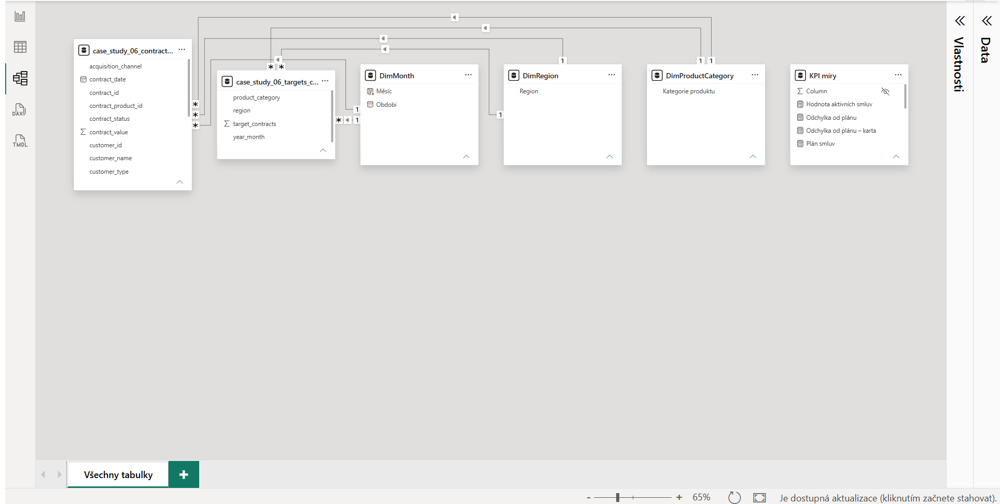
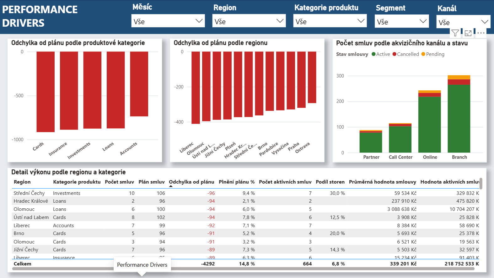

# Case Study 04 — Power BI Acquisition Performance Dashboard

## 1. Přehled projektu

Tato případová studie se zaměřuje na návrh a vytvoření manažerského Power BI reportu pro sledování výkonu akvizice nových smluv ve finančním prostředí.

Projekt navazuje na samostatnou SQL/Python přípravnou část, ve které byla vytvořena databáze, provedeno načtení dat, cleaning, validace a příprava finálních analytických datasetů.

Tato Power BI case study začíná na úrovni již připravených BI-ready dat a soustředí se především na:

- Power Query,
- datový model,
- DAX,
- návrh KPI,
- dashboard design,
- interaktivitu,
- management reporting.

Hlavní reportingové otázky:

- Kolik smluv bylo skutečně uzavřeno oproti plánu?
- Jaké je procentuální plnění plánu?
- Které regiony a produktové kategorie mají největší odchylku?
- Jaký je podíl aktivních a stornovaných smluv?
- Jak se liší výkonnost podle regionu, produktu a akvizičního kanálu?

---

## 2. Struktura projektu

```text
case-study-4/
│
├── dashboard/
│   └── case_study_06_dashboard.pbix
│
├── data/
│   ├── case_study_06_contracts_clean.json
│   └── case_study_06_targets_clean.json
│
├── screenshots/
│   ├── case_study_04_pbi_executive_overview.png
│   ├── case_study_04_pbi_performance_drivers.png
│   └── case_study_04_pbi_data_model.png
│
└── README.md
```

### Quick Links

- [Power BI Dashboard](dashboard/case_study_06_dashboard.pbix)
- [Contracts Dataset](data/case_study_06_contracts_clean.json)
- [Targets Dataset](data/case_study_06_targets_clean.json)
- [Executive Overview](screenshots/case_study_04_pbi_executive_overview.png)
- [Performance Drivers](screenshots/case_study_04_pbi_performance_drivers.png)
- [Data Model](screenshots/case_study_04_pbi_data_model.png)

---

## 3. Business zadání

Management potřebuje jednotný přehled o výkonnosti akvizice nových smluv.

Report má umožnit sledovat:

- skutečný počet smluv,
- plánovaný počet smluv,
- plnění plánu,
- odchylku od plánu,
- počet aktivních smluv,
- podíl stornovaných smluv,
- výkon podle regionu,
- výkon podle produktové kategorie,
- strukturu smluv podle akvizičního kanálu a stavu.

Cílovými uživateli reportu jsou zejména:

- top management,
- sales management,
- regionální management,
- produktoví manažeři.

---

## 4. Datové zdroje

Power BI report pracuje se dvěma připravenými analytickými datasety:

```text
case_study_06_contracts_clean.json
case_study_06_targets_clean.json
```

### Contracts dataset

Obsahuje například:

```text
contract_id
contract_date
contract_status
contract_value
customer_id
customer_type
region
acquisition_channel
product_name
product_category
target_segment
year_month
is_active
is_cancelled
is_pending
```

### Targets dataset

Obsahuje:

```text
year_month
region
product_category
target_contracts
```

Zdrojová data byla připravena v samostatné SQL/Python části projektu.

V rámci tohoto Power BI projektu se již neprovádí hlavní cleaning pipeline. Power Query slouží především jako poslední technická a integrační vrstva před vytvořením datového modelu.

---

## 5. Power Query

Power Query byl použit pro:

- načtení JSON souborů,
- rozbalení datové struktury,
- kontrolu datových typů,
- převod datumových polí,
- kontrolu boolean hodnot,
- poslední technické úpravy před načtením do modelu.

Hlavní cleaning a business validace byly provedeny již před Power BI vrstvou.

Tento přístup odděluje:

```text
data preparation
→ SQL / Python

semantic model & reporting
→ Power BI
```

---

## 6. Datový model

Report používá dvě hlavní datové tabulky:

```text
case_study_06_contracts_clean
case_study_06_targets_clean
```

a tři sdílené dimenze:

```text
DimMonth
DimRegion
DimProductCategory
```

Dimenze filtrují obě hlavní datové tabulky pomocí relací `1:*`.

Model tak umožňuje porovnávat skutečnost a plán ve stejném filtračním kontextu.

### Logika modelu

```text
                DimMonth
               /        \
              ↓          ↓
       Contracts       Targets

                DimRegion
               /        \
              ↓          ↓
       Contracts       Targets

         DimProductCategory
               /        \
              ↓          ↓
       Contracts       Targets
```

Tento model umožňuje analyzovat výsledky podle:

- období,
- regionu,
- produktové kategorie.



---

## 7. Klíčové DAX míry

V reportu byly vytvořeny zejména následující míry:

```text
Počet smluv
Plán smluv
Plnění plánu %
Odchylka od plánu
Počet aktivních smluv
Počet stornovaných smluv
Počet čekajících smluv
Podíl stornovaných smluv
Počet zákazníků
Hodnota aktivních smluv
Průměrná hodnota smlouvy
```

### Počet smluv

```DAX
Počet smluv =
DISTINCTCOUNT(
    case_study_06_contracts_clean[contract_id]
)
```

### Plán smluv

```DAX
Plán smluv =
SUM(
    case_study_06_targets_clean[target_contracts]
)
```

### Plnění plánu %

```DAX
Plnění plánu % =
DIVIDE(
    [Počet smluv];
    [Plán smluv]
)
```

### Odchylka od plánu

```DAX
Odchylka od plánu =
[Počet smluv]
- [Plán smluv]
```

### Počet aktivních smluv

```DAX
Počet aktivních smluv =
CALCULATE(
    DISTINCTCOUNT(
        case_study_06_contracts_clean[contract_id]
    );
    case_study_06_contracts_clean[is_active] = TRUE()
)
```

### Podíl stornovaných smluv

```DAX
Podíl stornovaných smluv =
DIVIDE(
    [Počet stornovaných smluv];
    [Počet smluv]
)
```

DAX zde slouží pro dynamické KPI, které se přepočítávají podle aktuálního filtračního kontextu.

---

## 8. Dashboard Pages

### Executive Overview

První stránka poskytuje management pohled na celkovou výkonnost.

Hlavní KPI:

```text
Počet smluv
Plán smluv
Plnění plánu
Skutečnost vs. plán
Aktivní smlouvy
Podíl storen
```

Hlavní vizualizace:

- skutečnost vs. plán podle měsíců,
- plnění plánu podle regionu,
- matice region × produktová kategorie.

Hlavní slicery:

- měsíc,
- region,
- produktová kategorie.

Report využívá podmíněné formátování pro rychlou identifikaci výkonnostních rozdílů.


---

### Performance Drivers

Druhá stránka se zaměřuje na detailnější vysvětlení výkonu.

Obsahuje:

- odchylku od plánu podle produktové kategorie,
- odchylku od plánu podle regionu,
- počet smluv podle akvizičního kanálu a stavu,
- detailní manažerskou tabulku.

Detailní tabulka kombinuje například:

```text
Region
Kategorie produktu
Počet smluv
Plán smluv
Odchylka od plánu
Plnění plánu %
Počet aktivních smluv
Podíl storen
Průměrná hodnota smlouvy
Hodnota aktivních smluv
```

Další slicery:

- segment,
- akviziční kanál.



---

## 9. Interaktivita reportu

Report využívá několik Power BI funkcí pro interaktivní analýzu.

### Synchronizované slicery

Slicery:

```text
Měsíc
Region
Kategorie produktu
```

jsou synchronizované mezi stránkami reportu.

Výběr provedený na jedné stránce se tak může automaticky promítnout i na druhé.

### Drill-through

Z přehledové stránky lze přejít na detailnější analýzu se zachováním vybraného kontextu.

Drill-through umožňuje například detailně analyzovat vybraný:

- region,
- produktovou kategorii.

### Conditional Formatting

Podmíněné formátování bylo použito zejména u:

- plnění plánu,
- odchylky od plánu,
- manažerské tabulky.

Cílem je rychle vizuálně odlišit slabší a silnější výkon.

---

## 10. Hlavní Power BI dovednosti procvičené v projektu

- Power Query ingestion,
- datové typy a technická příprava dat,
- návrh relačního modelu,
- sdílené dimenze,
- relace `1:*`,
- DAX measures,
- `DISTINCTCOUNT`,
- `CALCULATE`,
- `DIVIDE`,
- filter context,
- KPI design,
- kombinované grafy,
- matice,
- management tabulky,
- conditional formatting,
- slicery,
- synchronizace slicerů,
- drill-through,
- dashboard layout,
- management reporting.

---

## 11. Rozdělení rolí jednotlivých technologií

Projekt byl záměrně rozdělen podle toho, který nástroj je vhodný pro konkrétní část workflow.

```text
SQL / Python
→ data ingestion
→ cleaning
→ validation
→ preprocessing

Power Query
→ poslední technická příprava

Power BI model
→ relationships
→ filter context

DAX
→ dynamická KPI

Power BI visuals
→ reporting
→ interaktivita
```

Tento přístup omezuje zbytečné duplikování transformační logiky mezi jednotlivými vrstvami.

---

## 12. Produkční rozšíření

V této learning case study jsou do Power BI načítány připravené JSON soubory.

Pro pravidelný produkční reporting by bylo vhodnější použít například:

```text
Source Database
→ SQL / Python Data Pipeline
→ Clean Database Layer
→ Power BI
→ Scheduled Refresh
```

Power BI by tak načítal přímo připravenou databázovou vrstvu namísto statických JSON souborů.

Další možné rozšíření:

- automatizovaný refresh,
- Power BI Service,
- Row-Level Security,
- samostatné staging a analytical vrstvy,
- cíle podle akvizičních kanálů,
- cílová hodnota smluv,
- cancellation date a cancellation reason,
- acquisition costs,
- salesperson / team dimenze,
- další drill-through stránky,
- tooltip pages.

---

## Shrnutí

Case Study 04 je zaměřena především na Power BI vrstvu analytického řešení.

Hlavní workflow:

```text
BI-ready data
→ Power Query
→ Data Model
→ DAX
→ Dashboard
→ Interactive Analysis
```

Projekt ukazuje schopnost převést připravená analytická data do přehledného management reportu s důrazem na:

- datové modelování,
- DAX,
- KPI reporting,
- interaktivitu,
- dashboard design,
- business interpretaci.

SQL a Python zde tvoří upstream data preparation vrstvu, zatímco hlavním výstupem této case study je profesionálně strukturovaný Power BI report.